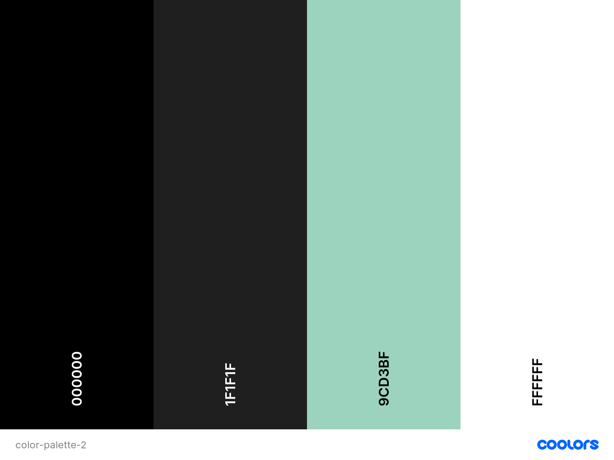

# Pre-Owned

Pre-owned is a website that sells pre-owned clothes, whether you want to buy clothes that have already been owned by someone else previously because it’s better for the environment or because you can find more original pieces of clothing this is the store for you. The project is created for educational purposes only.

## UX

### Strategy 

The purpose of the project is to create a website for people who wants to buy good quality modern clothes but that has been owned previously owned by someone else making it more affordable than buying new clothes and better for the environment. The target audience is people who are interested in fashion but also are concerned about the sustainability of the fashion industry and wants to lower their negative impact on the environment by buying pre-owned clothes. 

### Scope

Site owner’s goal: To create a website where fashion interested people can buy clothes that they like without having the same impact on the environment that new clothes and that are affordable. 

User’s goal: To find modern clothes that have a lower impact on the environment and are more affordable by being pre-owned.  

#### User Stories 

As an anonymous user: 
-	I want to browse the products the company is offering.
-	I want to be able to sign up to become a registered user. 

As a registered user 
-	I want to be able to log in to my account. 
-	I want to be able to log out of my account. 
-	I want to be able to save products that I like to my profile so I can easily find them later. 
-	I want to be able to add and delete products to my shopping bag.
-	I want to be able to see my orders.
-	I want my information to be saved for my purchases so that I do not have to fill it in for every new purchase. 
-	I want to be able to buy the products I have chosen. 
-	I should only be able to see my own profile page and favorites. 
-	I should only be able to change the profile information of my own profile.
-   I want to be able to get in contact with the site owner if I have any questions. 

### Structure 

The main purpose of the website is for people to buy clothes, therefore, this will be the most important to get access to on the website. Users that are not registered to the website can’t make a purchase, but they can still browse the clothes on the website to see if they find something they are interested in before having to sign up. The supporting content for registered users is that they can save favorites that they can see on their profile while logged in to their account and that they easily can contact the site owner if they have any questions to make the experience of the website as good as possible. 

### Skeleton 

Figma was used to create the wireframes, you can find them [here](https://www.figma.com/file/g7pvumQdDUknm1F5sEVoK9/MS4?node-id=0%3A1).

There are some changes made in the final website making it not match completely to the wireframes. Some fetaures are slightly changed to make them work better in the live project and based on feedback gotten on the website and some smaller things have not been implemented because of time issues, like searching and some filtering options which could be implemented in the project in the future. 

#### Database schema

DBdiagram was used to create a database schema, you can find it [here](media/database.png).

### Surface 

#### Colors 
For this project, a simple color palette is chosen with black, white, dark grey, and one mint green accent color. The reason behind choosing a simple color palette is for the clothes to be the focal point on the website. 



#### Typography 

The font chosen for this project is Permanent Marker for the logo and Lato for the rest of the text on the website, the fallback font for both fonts is Sans-Serif Both fonts are found on Google Fonts.   

## Features 

### Existing Features

- Navbar
    - The navbar contains links to different parts of the website and the company logo. The navbar also contains a search field so the user can search for specific products on the website. The navbar is sticky so that the user always can navigate to different parts of the website. 
    - As a registered user, you will have access to your profile, your favorites, and your shopping bag.
- Footer
    - The footer contains links to social media and an about us section. 
- Home page 
    - Navbar (described under navbar)
    - Underneath the navbar is the logo, some text about the store, and a link to the products page. 
    - Footer (described under footer)
- Products page
    - Navbar (described under navbar)
    - The products page contains images of the clothes and the title, price and size are displayed underneath the image.
    - Footer (described under footer)
- Selected product page 
    - Navbar (described under navbar)
    - Underneath the navbar, an image of the selected product is presented and all the information about the product, the title size, price, and color of the product.
    - On this page, a button for adding the item from favorites is also presented.
    - On this page, there is also a button for the user to add the product to their shopping bag. 
    - Footer (described under footer)
- My shopping bag page 
    - Navbar (described under navbar)
    - Underneath the navbar on this page all the products added to the user's bag are presented, information of the products. There also is a 
    link for the user to remove the item from the shopping bag. 
    - Underneath the items in the shopping bag, there are fields for the details necessary for completing the purchase, shipping, and payment details. And at the end above the footer, a button to complete the purchase is presented. 
    - Underneath the items in the shopping bag, a button to go to checkout is presented. 
    - Footer (described under footer)
- Checkout page 
    - On the checkout page to the left, there is a form where the user has to fill out all the required information and a payment form where the user fills out their card details. Underneath the card retails is a complete order button. 
    - To the left is an order summary. 
    - When clicking on the button the user goes to the order success template where all the order information is presented. 
- My profile page
    - Navbar (described under navbar)
    - Under the navbar, the information about the user is presented in a form where the user also can update their information. 
    - Next to the profile information are the user's orders presented. 
    - Underneath the profile information and the orders, the messages that the user has sent to the site owners are available together with the responses that the users have received. 
    - Footer (described under footer)
- My favorites page
    - Navbar (described under navbar)
    - Underneath the navbar, on this page, all the items that the users have added to their favorites page are shown. There is an image of the product, and a link to remove the product from favorites, the title, price, and size of the item. 
    - Footer (described under footer)
- Log in page 
    - Navbar (described under navbar)
    - Underneath the navbar, the login form is presented with a field for the user to fill in their email and password and a button on the bottom to log in to their account. 
    - Footer (described under footer)
- Register page
    - Navbar (described under navbar)
    - Underneath the navbar, the form for new users is presented on this page. There is a field for the user to fill in their email, password and to confirm the password that they have chosen, at the end of the form it is a button to register. 
    - Footer (described under footer) 
- Contact page 
    - Navbar (described under navbar)
    - Underneath the navbar the contact form is presented, the field for the user to enter in their message is presented and underneath a button to submit the form is available. 
    - Footer (described under footer)

### Possible Future Features 

## Technologies Used 

- [Django](https://www.djangoproject.com/) is used to create the project.  
- [HTML5](https://en.wikipedia.org/wiki/HTML5) is used to make the structure of the website.
- [CSS3](https://en.wikipedia.org/wiki/CSS) is used to add style to the project.
- [Python3](https://www.python.org/) is used as the backend language.
- [JQuery](https://jquery.com/) is used to create interactive elements.
- [Heroku](https://id.heroku.com/login) is used to deploy the live website.
- [Bootstrap](https://getbootstrap.com/) is used to style certain elements and to make the website responsive.
- [Font Awesome](https://fontawesome.com/) is used for the icons in the footer.
- [Google Fonts](https://fonts.google.com/) is used to import the fonts used in the project.
- [Gitpod](https://gitpod.io/) is used to develop the project.
- [Github](https://github.com/) is used to store the source code for the project.
- [Figma](https://www.figma.com/) is used to make wireframes for the project.
- [Stripe API](https://stripe.com/en-se) is used for payments.
- [Django Secret Key Generator](https://miniwebtool.com/django-secret-key-generator/) is used to generate a Django secret key.


## Testing

You can find the testing document [here](TESTING.md)

## Deployment

### Deploy to Heroku

1. Create an account on Heroku if you don't have one.
2. Log in to your Heroku account and to the right on the screen and choose **Create New App**.
3. Fill in a unique name in the app name text field.
4. Choose the region closest to you in the choose a region dropdown list.
5. Click on **Create App**.
6. Go to the recourse tab and in the search field search for Postgres and choose **Heroku Postgres**. 
7. For plan choose 'Hobby Dev - Free' and click on **Submit Order Form**. 
8. Go back to your terminal and install Dj Database by typing `pip3 install dj_database_url` in your terminal. 
9. Install psycopg2-binary by typing `pip3 install psycopg2-binary` in your terminal. 
10. Freeze your requirements by typing `pip3 freeze > requirements.txt` in your terminal.
11. Import dj_database_url in settings.py.
12.  In database setting comment, put the default configuration.
11. Replace the default database with dj_database_url.parse() and add in the database URL from Heroku.
You can find this in the Config Vars in the settings tab.
12. Migrate by typing `python3 manage.py migrate` in the terminal and if you have fixtures you can add them back in now. 
13. You need to create a new superuser by typing `python3 manage.py createsuperuser` in the terminal.
14. Uncomment the default database in settings.py and remove the Heroku database config.
15. Set an if statement to use Postgres when the app is running on Heroku, where the database URL is defined or the default database otherwise. 
16. Install gunicorn by typing `pip3 install gunicorn` in the terminal and freeze the requirements again. 
17. Create a Procfile and write `web: gunicorn your_app_name.wsgi:application` in it. 
18. Log in to Heroku by typing `heroku login` in the terminal and log in. 
19. Type `heroku config:set DISABLE_COLLECTSTATIC=1 --app your_app_name` to temporary disable collectstatic.
20. Add the hostname of your Heroku app and `localhost` in `ALLOWED_HOSTS = []` in settings.py.
21. Add your changes by typing `git add .`, commit by typing `git commit -m"your_commit_message"` and push to GitHub by typing `git push in the terminal`.
22. Then type `git push heroku master` in the terminal to push to Heroku.
23. Go to your app in Heroku and under the deploy tab Click on connect to GitHub, search for your repository, click on connect, and then enable automatic deploys.

### Connect to Amazon Webservices
1. Follow the instructions [here](https://docs.aws.amazon.com/AmazonS3/latest/userguide/creating-bucket.html) to create your Bucket in Amazon Webservices.
2. Then create a group and a user in AWS through IAM. You can find instructions on how to create user groups [here](https://docs.aws.amazon.com/IAM/latest/UserGuide/id_groups_create.html) and how to add users [here](https://docs.aws.amazon.com/IAM/latest/UserGuide/id_users_create.html). 
3. Install boto3 by typing `pip3 install boto3` in the terminal
4. Install Django storage by typing `pip3 install django-storages` in the terminal
5. Freeze your requirements by typing `pip3 freeze > requirements.txt` in your terminal.
6. Add storages to your installed apps in settings.py
7. Add these settings in your settings.py 
```
    if 'USE_AWS' in os.environ:
    AWS_S3_OBJECT_PARAMETERS = {
        'Expires': 'Thu, 31 Dec 2099 20:00:00 GMT',
        'CacheControl': 'max-age=94608000',
    }
    AWS_STORAGE_BUCKET_NAME = 'pre-owned'
    AWS_S3_REGION_NAME = 'eu-north-1'
    AWS_ACCESS_KEY_ID = os.environ.get('AWS_ACCESS_KEY_ID')
    AWS_SECRET_ACCESS_KEY = os.environ.get('AWS_SECRET_ACCESS_KEY')
    AWS_S3_CUSTOM_DOMAIN = f'{AWS_STORAGE_BUCKET_NAME}.s3.amazonaws.com'
```
8. On Heroku add AWS_ACCESS_KEY_ID, AWS_SECRET_ACCESS_KEY, USE_AWS to True in the Config Vars and remove DISABLE_COLLECT_STATIC. 
9. Create a file Called custom_storages.py and add in
```
    from django.conf import settings
    from storages.backends.s3boto3 import S3Boto3Storage

    class StaticStorage(S3Boto3Storage):
    location = settings.STATICFILES_LOCATION

    class MediaStorage(S3Boto3Storage):
    location = settings.MEDIAFILES_LOCATION
```
10. Add this in settings.py
```
    STATICFILES_STORAGE = 'custom_storages.StaticStorage'
    STATICFILES_LOCATION = 'static'
    DEFAULT_FILE_STORAGE = 'custom_storages.MediaStorage'
    MEDIAFILES_LOCATION = 'media'

    STATIC_URL = f'https://{AWS_S3_CUSTOM_DOMAIN}/{STATICFILES_LOCATION}/'
    MEDIA_URL = f'https://{AWS_S3_CUSTOM_DOMAIN}/{MEDIAFILES_LOCATION}/'
```
11. Add your changes by typing `git add .`, commit by typing `git commit -m"your_commit_message"` and push to Heroku by typing `git push in the terminal`.
12. Now you can add your media files to 3S. 
13. Confirm the email address for your superuser in the admin or by the email confirmation link. 
14. Add stripe to the Heroku config vars add STRIPE_PUBLIC_KEY and STRIPE_SECRET_KEY, you can find them on stripe under developers and the API keys. 

### Run code locally 
1. Find the repository you want and click on it.
2. Above all the files in the repository click on the green Gitpod button.
3. This opens a new copy of the workspace on Gitpod. You should only do this once and then you can access the workspace directly from Gitpod. If you press the green Gitpod button again it will create a new copy of the workspace on Gitpod.
4. You can now edit the workspace locally.
5. If you want to open a preview window of the workspace in the browser you can type in the command: python3 manage.py runserver in the terminal and then click open browser in the pop-up window down to the right.

## Credits 

### Code 
The foundation of this site is sourced from [Code Institute Educational material - Boutique Ado](https://github.com/Code-Institute-Solutions/boutique_ado_v1)

[This](https://www.twilio.com/blog/build-contact-form-python-django-twilio-sendgrid) document was used to help build the contact app

Bootstrap was used to style elements and make the site responsive.

### Media 

[sweater image from](https://www.pexels.com/photo/woman-in-yellow-sweater-smiling-3732881/)
[pants image from](https://www.pexels.com/photo/slender-teen-with-bright-yellow-skateboard-5325881/)
[skirt image from](https://www.pexels.com/photo/woman-holding-green-and-red-leather-handbag-932401/)
[outerwear image from](https://www.pexels.com/photo/standing-woman-holding-cup-of-drink-3418753/)
[dress image from](https://www.pexels.com/photo/woman-in-red-spaghetti-strap-dress-standing-near-brown-wooden-post-5822660/)
