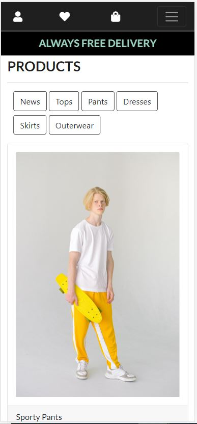
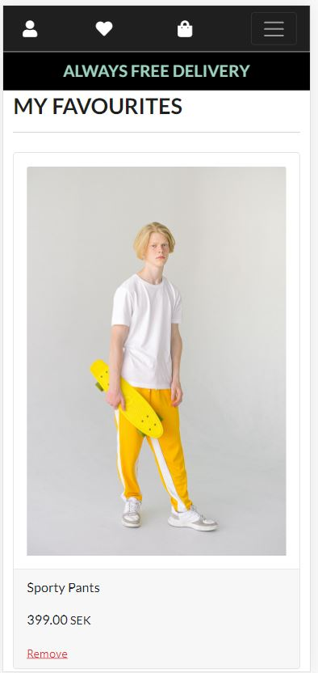

## Testing 

### Validation 

- To test the CSS the [W3C CSS Validation Service](https://jigsaw.w3.org/css-validator/) was used.
    The CSS validator showed no errors or warnings.

- To test the HTML the W3C Markup Validation Service was used.
    The HTML validator showed no errors or warnings.

- To test JQuery JSHint was used.
    JSHint showed no errors or warnings.

- Flake 8 was used to test the python code, the warnings that are left are mostly from the python migrate files or variables in the settings that are too long and can't be divided into too two rows or to avoid using null=true on Charfields.

### Features

#### Manual Testing of Navbar 
-	Clicking on the logo reloads the homepage.
-	Clicking on the profile icon and a dropdown menu shows.	
    -	As an anonymous user, the dropdown shows register and log in. Clicking on the register link brings the user to the register page. Clicking on the login link brings the user to the login page. 
    -	As a registered user the dropdown shows my profile and log out. Clicking on my profile link brings the user to my profile page. Clicking on the log out link brings the user to the log out page. 
-	Clicking on the favorites icon as an anonymous user brings the user to the log in page.
-	Clicking on the favorites icon as a registered user brings the user to my favorites page.  
-	Clicking on the shopping bag icon brings the user to the shopping bag page. 
-	Clicking on the Home link brings the user to the home page.
-	Clicking on the Shop link brings the user to the products page.
-   Clicking at the contact link as an anonymous user brings the user to the log in page.
-   Clicking at the contact link as an registered user brings the user to the contact page.

#### Manual Testing of Footer
-	Clicking the Instagram icon brings the user to instagram.com in a new browser window. 
-	Clicking the Facebook icon brings the user to facebook.com in a new browser window.
-	Clicking the LinkedIn icon brings the user to linkedin.com in a new browser window.

#### Manual Testing of Home Page 
-	Clicking on the shop now button brings the user to the products page. 

#### Manual Testing of Products Page
-	Clicking on the product image brings the user to the selected product page of that product.
-   Clicking on the news button shows the user all the products with the product added last first on the products page.
-   Clicking on the tops button shows the user only the tops on the products page. 
-   Clicking on the pants button shows the user only the pants on the products page. 
-   Clicking on the dresses button shows the user only the dresses on the products page. 
-   Clicking on the skirts button shows the user only the skirts on the products page. 
-   Clicking on the outerwear button shows the user only the outerwear on the products page. 

#### User Stories Testing of Products Page
-	I want to browse the products the company is offering.
    -	On the products page the user can see all the avalible products that the store have. 

#### Manual Testing of Selected Product Page
-	Clicking on the add to shopping bag button adds the product to the shopping bag and a success message is shown. 
-	Clicking on the add to favorite button as a registered user adds the product to favorites and a success message is shown. 
-	Trying to add a product to favorites as an anonymous user and the user gets redirected to the login page.  

#### Manual Testing of My Shopping Bag Page
-	Clicking on the remove button on the product in the shopping bag and the delete modal shows asking the user if they are sure they want to remove the product.
    - Clicking on the remove button removes the product and a success message is show. 
    - Clicking on the close button or outside the modal and the modal disepears and the product isn't deleted from the shopping bag. 
-	Clicking on the secure checkout button as an anonymous user redirects the user to the log in page.
-	Clicking on the secure checkout button as a registered user brings the user to the checkout page.
#### User Stories Testing of My Shopping Bag Page
-	I want to be able to add and delete products to my shopping bag.
    -	On the selected products page the user can add products to their shopping bag. 

#### Manual Testing of My Profile Page
-   Trying to submit the form without filling in the minimum lenth of charachters in the fields and a message shows to lengthen the text in the field.
-   Trying to submit the form with more than the maximium numbers of charachters allowed and a message shows to saying how many characters are allowed and how many are in the field right now. 
-   Trying to submit the form with special characters in the fields or anything else than numbers and + in the phone number field and a message shows saying which characters are allowed in that field. 
-   Trying to submit the form without all the fields filled in and a message shows to fill out field. 
-   Trying to submit the form with only spaces in one of the fields and a message shows that the field are required.
-	Filling out the default delivery information form and clicking on the update information button and the default delivery is saved in the form. 
-	Changing in the default delivery information form when it’s filled in and clicking on the update information button updates the information in the form.
-	Clicking on the order number of one of the users’ orders brings the user to the checkout success page of that order and an alert message shows. 
-	Saving the URL for the profile page and tries to access it as an anonymous user redirects the user to the log in page. 
-	Saving my profile URL for one user and tries to access it as another user brings the user to their own profile page. 

#### User Stories Testing of My Profile Page
-	I want to be able to see my orders.
    -	On the user profile, the user can access all the past orders that the user has made.
-	I want my information to be saved for my purchases so that I do not have to fill it in for every new purchase.
    -	On the profile page, the user can save information that automatically will be added to the form in the checkout when purchasing a product.
-	I should only be able to change the profile information of my own profile.
    -	The user can only access their own profile and can therefore also only change their own profile.

#### Manual Testing of My Favorites Page
-	Clicking on one of the products images brings the user to the selected products page of that product.
-	Clicking on the remove button on the product in favorites and the delete modal shows asking the user if they are sure they want to remove the product.
    - Clicking on the remove button removes the product and a success message is show. 
    - Clicking on the close button or outside the modal and the modal disepears and the product isn't deleted from favorites. 
-	Saving the favorites URL for one user and tries to access it as another user brings the user to their own favorites page. 
#### User Stories Testing of My Favorites Page
-	I want to be able to save products that I like to my profile so I can easily find them later.
    -	On the selected product page a user can add a product to favorites to later be able to find them on the favorites page.

#### Manual Testing of Log In page
-	Clicking on the log in link brings the user to the log in page.
-	Trying to log in with the wrong email address and a message shows that the email or password is incorrect. 
-	Trying to log in without the correct password and a message shows that the email or password is incorrect.
-	Trying to log in with all the correct information filled in and the user gets logged in and a success message is shown. 
-	Clicking on the forgot password page brings the user to the password reset. 
-	Filling in the email to reset the password and an email with a link to reset the users' password is sent to the email. Reset the password via the link and tries to login with the new password and the user gets logged in to their account and a success message shows. 
#### User Stories Testing of Log In Page
- I want to be able to log in to my account.
    - On the log in page registered users can log in to their account.

#### Manual Testing of Log Out Page
-	Clicking on the sign out button and the user gets logged out from their account and a success message shows.
#### User Stories Testing of Log Out Page
-	I want to be able to log out of my account.
    -	On the log out a logged in user can log out from their account.  

#### Manual Testing of Register Page
-	Clicking on the register link brings the user to the register page.
-	Trying to register without filling in any fields and a message shows to fill out field.
-	Trying to register without filling in an email address at the email field and a message shows that the email field must include a @. 
-	Trying to register without the passwords matching each other and a message shows that the password needs to be the same each time. 
-	Trying to register a user with an email address that is already registered and this shows a message that a user already is registered on that email. 
-	Trying to register with all the required information filled in and this brings me to the verify email address page and an alert message shows and a verification email has been sent to the email address, after verifying the email the user can sign in to their account.  
-	Trying to log in as a user who has registered but not verified the email redirects user to the verify you email address page.
#### User Stories Testing of Register Page
-	I should only be able to see my own profile page and favorites.
    -	See manual testing, a user can only access their own pages that require the user to be logged in, otherwise the user will be redirected to the login page or their own page in logged in state. 

#### Manual Testing of Checkout page
-	Clicking on the complete order button without filling in all the information in the form and a message appears to fill out the form. 
-	Clicking on the complete order button without filling out the correct payment details and a message shows that my card number is incomplete. 
-	Clicking on the complete order button with all the correct information filled in and brings the user to the order success page with the information about the order.
-	Clicking on the complete order button with all the correct information filled in and make sure that the payment is succeeded in stripe.
-	Saving the URL for the checkout page and tries to access it as an anonymous user brings the user to the login page. 
-	Saving the URL for the checkout success page and tries to access it as an anonymous user brings the user to the login page. 
#### User Stories of Checkout page
-	I want to be able to buy the products I have chosen.
    -	In the checkout, the user can complete a purchase to buy one or several products. 

#### Manual Testing of Contact Page
-	Trying to submit form without all required fields filled in and a message appears to fill out fields. 
-	Trying to submit the form with required fields filled in and the form submits, and a success message appears. 
-	Trying to access the contact page as an anonymous user and user gets redirected to the login page. 
-	Saving the URL for the contact page and tries to access it as an anonymous user and user gets redirected to the login page.
#### User Stories Testing of Contact Page
-	I want to be able to get in contact with the site owner if I have any questions.
    -	Logged in users can send a message on the contact page to get in touch with the site owner. 

### Responsiveness

In Chrome DevTools following devices have been tested for responsiveness:

Moto 4
Galaxy S5
Pixel 2
Pixel 2 XL
iPhone 5/SE
iPhone 6/7/8
iPhone 6/7/8 Plus
iPhone X
iPad
iPad Pro
Surface Duo
Galaxy Fold

### Browsers

The website is tested on Chrome, Opera, Microsoft Edge, Safari, and firefox. Though some of the styling of the website doesn't seem to work on firefox.

### Open Bugs
- A user can add several favorites of the same product, which they shouldn't be able to do, this also disrupts the remove function since it only gets one object. 